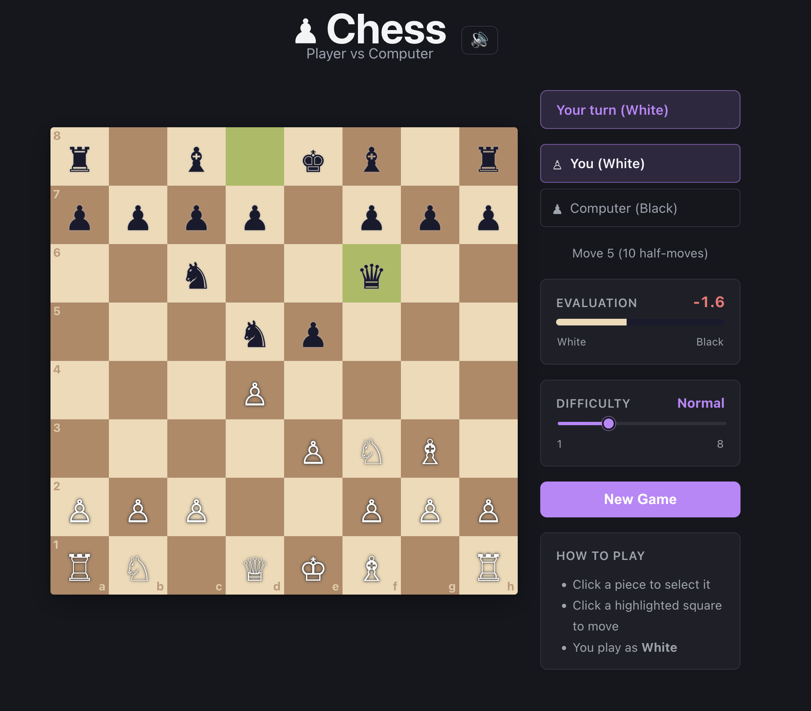

# ♟ React Chess

A single-player chess game built with React 19 and TypeScript. Play as White against a computer opponent powered by a minimax AI with alpha-beta pruning. No external chess libraries — the engine is written from scratch.



## Features

- **Full chess rules** — legal move generation for all piece types, castling (kingside & queenside), en passant, pawn promotion, and draw by stalemate
- **Check / checkmate detection** — the king flashes red when in check; the game ends with a clear result message
- **Computer opponent** — minimax search with alpha-beta pruning (depth 3) and piece-square positional tables
- **Move highlighting** — selected piece, valid destinations (dots / capture rings), and last-move highlights
- **Pawn promotion dialog** — choose Queen, Rook, Bishop, or Knight when a pawn reaches the back rank
- **Captured pieces display** — both players' captured pieces are shown above and below the board
- **Procedural sound effects** — 7 distinct sounds generated via the Web Audio API (no audio files)
- **Mute toggle** — 🔊/🔇 button in the header
- **Responsive layout** — adapts from desktop to mobile; squares scale with viewport width
- **Dark mode** — respects `prefers-color-scheme` automatically

## Getting Started

### Prerequisites

- Node.js 18+
- npm 9+

### Install & run

```bash
npm install
npm run dev
```

Open [http://localhost:5173](http://localhost:5173) in your browser.

### Other scripts

| Command | Description |
|---------|-------------|
| `npm run dev` | Start the Vite dev server with HMR |
| `npm run build` | Type-check and build for production |
| `npm run preview` | Preview the production build locally |
| `npm run lint` | Run ESLint |

## How to Play

1. Click any of your **White** pieces to select it — valid moves are highlighted with dots (empty squares) or rings (captures).
2. Click a highlighted square to move.
3. When a pawn reaches the far rank a **promotion dialog** appears — choose your piece.
4. The computer replies automatically as **Black**.
5. Click **New Game** at any time to reset.

## Project Structure

```
src/
├── chess/
│   ├── types.ts        # TypeScript types: Piece, Move, GameState, …
│   ├── engine.ts       # Chess rules: move generation, check detection, makeMove
│   └── ai.ts           # Minimax AI with alpha-beta pruning & piece-square tables
├── components/
│   ├── Board.tsx        # Interactive 8×8 board with highlights
│   └── PromotionDialog.tsx  # Pawn promotion piece picker
├── hooks/
│   └── useSound.ts     # Web Audio API procedural sound effects
├── App.tsx             # Game orchestration, AI turn loop, layout
├── App.css             # All component styles (responsive + dark mode)
└── index.css           # Global CSS variables and resets
```

## Architecture

### Chess Engine (`src/chess/engine.ts`)

Pure TypeScript functions — no side effects, fully immutable board copies.

| Function | Description |
|----------|-------------|
| `initializeGameState()` | Returns the starting `GameState` |
| `getLegalMoves(board, pos, …)` | All legal moves for a piece at `pos` |
| `getAllLegalMoves(board, color, …)` | All legal moves for a given side |
| `makeMove(state, move)` | Returns a new `GameState` after applying `move` |
| `isInCheck(board, color)` | Returns `true` if `color`'s king is in check |
| `isSquareAttacked(board, pos, byColor)` | Attack detection used for check & castling |

### AI (`src/chess/ai.ts`)

The AI treats chess as a two-player zero-sum game: what is good for White is equally bad for Black. All scores are in **centipawns** (1 pawn = 100 points), positive for White and negative for Black.

#### Step 1 — Static Evaluation (`evaluateBoard`)

When the search reaches its depth limit it calls `evaluateBoard()` to score the position without looking any further ahead. The score is the sum of two components for every piece on the board:

1. **Material value** — a fixed point value per piece type:

   | Piece | Value |
   |-------|------:|
   | Pawn | 100 |
   | Knight | 320 |
   | Bishop | 330 |
   | Rook | 500 |
   | Queen | 900 |
   | King | 20 000 |

2. **Piece-square table (PST) bonus** — each piece type has an 8×8 table of positional bonuses/penalties. For example, knights are rewarded for occupying central squares and penalized at the edges; the king is rewarded for staying in a corner (safety) and penalized for venturing toward the center. White uses the table as written; Black's table is mirrored vertically so both sides share the same positional incentives.

#### Step 2 — Move Ordering (`orderMoves`)

Before searching, candidate moves are sorted so that **captures come first**, ranked by the value of the piece being captured (MVV-LVA — Most Valuable Victim, Least Valuable Attacker). Examining high-value moves early raises the alpha-beta bounds quickly, causing more branches to be pruned and making the overall search much faster.

#### Step 3 — Minimax with Alpha-Beta Pruning (`minimax`)

The search alternates between two roles each ply (half-move):

- **Maximizing** (White's turn) — picks the move with the highest score.
- **Minimizing** (Black's turn) — picks the move with the lowest score.

```
getBestMove (root — AI's turn)
 └─ for each candidate move:
      apply move → minimax(depth - 1)
                    └─ opponent's reply → minimax(depth - 2)
                          └─ ... until depth = 0 → evaluateBoard()
```

**Alpha-beta pruning** avoids exploring branches that cannot change the final result:
- `alpha` — the best score the maximizer has found so far.
- `beta` — the best score the minimizer has found so far.
- When `beta ≤ alpha` the current branch is abandoned immediately, because the opponent already has a refutation.

**Terminal conditions** (base cases):
- `depth === 0` → return `evaluateBoard()`.
- No legal moves + king in check → **checkmate**. The score is adjusted by the remaining depth so the AI prefers delivering faster mates (and delaying being mated).
- No legal moves + king not in check → **stalemate**, score = 0.

**Immutable state threading** — the engine never mutates the board. Each recursive call receives new copies of the board, castling rights, and en-passant target derived from the move just applied, so sibling branches are never affected by one another.

#### Step 4 — Root Search (`getBestMove`)

`getBestMove()` is the entry point called from `App.tsx` on every AI turn:

1. Generate all legal moves for the AI's color.
2. **Filter promotions** to queen-only — underpromotions are almost never optimal and would multiply the branching factor.
3. **Shuffle** the filtered list so that equal-scoring moves produce different games.
4. **Order** the shuffled list (captures first) and evaluate each candidate by calling `minimax` at `depth - 1`.
5. Return `{ move, score }` — the score drives the evaluation bar displayed in the UI.

#### Difficulty

The `searchDepth` setting (1–8) maps directly to minimax depth. Each additional ply multiplies the work roughly by the average branching factor (~30 legal moves), so higher depths grow exponentially:

| Depth | Label | Character |
|------:|-------|-----------|
| 1 | Beginner | Looks 1 move ahead |
| 2 | Easy | Looks 2 moves ahead |
| 3 | Normal (default) | Looks 3 moves ahead |
| 4 | Hard | Looks 4 moves ahead |
| 5 | Expert | Looks 5 moves ahead |
| 6 | Master | Looks 6 moves ahead |
| 7 | Insane | Looks 7 moves ahead |
| 8 | Maximum | Looks 8 moves ahead |

### Sound (`src/hooks/useSound.ts`)

All sounds are synthesised at runtime using the Web Audio API (`OscillatorNode` + `GainNode` with ADSR-style envelopes). The `AudioContext` is created lazily on the first user interaction to satisfy browser autoplay policies.

| Sound | Trigger |
|-------|---------|
| `move` | Normal piece move |
| `capture` | A piece is taken (or en passant) |
| `castle` | Kingside or queenside castling |
| `check` | Moving side puts opponent in check |
| `promote` | Pawn promotion |
| `checkmate` | Game ends by checkmate |
| `stalemate` | Game ends by stalemate |

## Tech Stack

| Technology | Version | Role |
|------------|---------|------|
| React | 19.2 | UI framework |
| TypeScript | 5.9 | Type safety |
| Vite | 8 | Build tool & dev server |
| Web Audio API | — | Procedural sound effects |

## License

MIT
